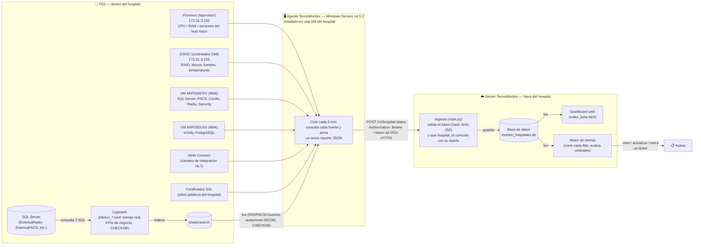

# Arquitectura — de dónde sale cada dato hasta que llega a un ticket de Asana

Explicación desde cero, pensada para alguien que nunca instaló el agente. Usa **P03** (el hospital
piloto) como ejemplo concreto: nombres de VM y direcciones IP reales de ese sitio, para que se pueda
seguir el flujo con datos reales en vez de placeholders genéricos.

## El recorrido completo, en una frase

Un montón de fuentes distintas dentro del hospital (hipervisor, controlador RAID, Windows, SQL
Server, Mirth, certificados) son leídas por **un agente instalado en el hospital**, que arma un
reporte y lo manda por HTTPS a **un server central** (fuera del hospital), autenticado con un
**token propio de ese hospital**. El server guarda el dato, lo muestra en el dashboard, y un motor de
alertas lo revisa cada minuto para abrir/cerrar tickets en Asana solo.

## Diagrama

## Las fuentes de datos, agrupadas

No todas las fuentes se leen de la misma forma ni con la misma frecuencia — es importante para
entender qué falla si algo se corta:

| Grupo | Fuentes en P03 | Cómo las lee el agente |
|---|---|---|
| **Físico** | Proxmox (hipervisor), iDRAC (RAID/sensores del servidor Dell) | API propia de cada uno, directo desde el agente |
| **Virtual** | VMs Windows (`ARP03APPV`, `ARP03EU0V`) | WMI, directo desde el agente |
| **Software — directo** | Mirth Connect, certificados SSL | API/HTTP propio de cada uno, directo desde el agente |
| **Software — vía Elastic** | KPIs de negocio (RIS/PACS/Usuarios), autoenrutado DICOM, integridad de bases (CHECKDB) | SQL Server → **Logstash** (pipelines `.conf`, corren como tareas programadas de Windows) → **Elasticsearch** → el agente lee el índice, no toca SQL Server directamente |

El camino "vía Elastic" es el que más partes en movimiento tiene: si Logstash no puede conectar a SQL
Server (fue el problema real que encontramos hoy en P03: un host mal configurado), esos tres módulos
se quedan sin datos nuevos aunque el resto del agente siga funcionando perfecto — son fuentes
independientes entre sí.

## El token

Cada hospital tiene su **propio token**, creado al dar de alta el hospital en el panel de
Configuración del server. El agente lo manda en cada envío (`Authorization: Bearer <token>`); el
server nunca lo guarda en texto plano, guarda su hash SHA-256 y compara. Si el token no coincide, o
coincide con un hospital distinto al que dice el reporte (`hospital_id` del `envelope`), el server
devuelve `401` y descarta el reporte entero — visto desde el dashboard, ese hospital simplemente deja
de reportar.

## Qué hace el server con el dato

1. **Ingesta**: valida el token, y si es válido, guarda el reporte — cada sección del JSON (físico,
   virtual, software, KPIs, integridad de bases) va a su tabla correspondiente.
2. **Visualización**: el dashboard lee esas tablas para armar el detalle de cada hospital — nada se
   calcula "en vivo" contra el hospital, todo sale de lo último que guardó el agente.
3. **Motor de alertas**: corre solo, cada 60 segundos, releyendo la base de datos (no el hospital
   directo). Evalúa reglas por tipo de dato (ej. "¿algún canal de Mirth lleva 2 ciclos caído?",
   "¿alguna base quedó en `ERROR` en el último CHECKDB?") y, si corresponde, crea, actualiza o cierra
   un ticket en Asana — sin que nadie lo dispare a mano.

Ver el contrato completo del reporte JSON en
[10-contrato-ingesta-agente.md](./10-contrato-ingesta-agente.md).
